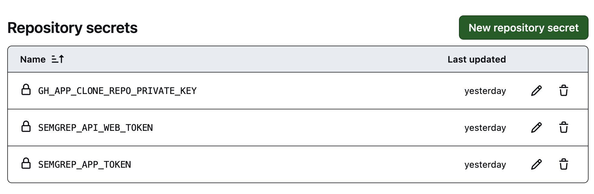
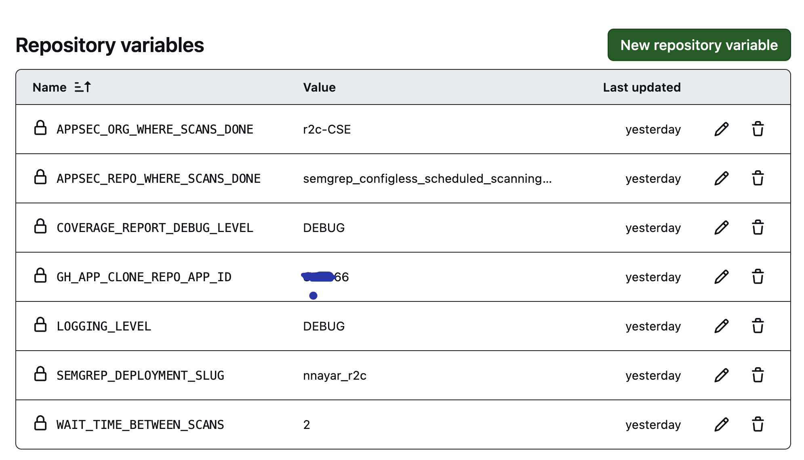

# How to run Semgrep Scheduled scans on all repos in a given GitHub Org: Option-2 using Repository_Dispatch (Final)

# Why?

Customers want to onboard Semgrep quickly without having to go to each team one by one and ask them to add Semgrep to their repo’s workflow files.

They can do this for PR’s using [Repository rulesets](https://docs.github.com/en/repositories/configuring-branches-and-merges-in-your-repository/managing-rulesets/about-rulesets). 

We can now also accomplish scheduled full scans using the solution below

The solution below can be used in conjunction with the Repository Rulesets to get additional coverage.

# How?


We create a new repo - `appsec-repo` (for example) that is owned by the App Sec team. In this repo we create a workflow file that is triggered on `Workflow_Dispatch` and `Scheduled` trigger. We have 2 different schedules:
* daily
* weekly


```yaml
on:
  # Scan on-demand through GitHub Actions interface:
  workflow_dispatch: {}
  # Schedule the CI job (this method uses cron syntax):
  schedule:
    - cron: '20 17 * * *' # Sets Semgrep to scan every day at 17:20 UTC.
```

The workflow performs the following steps:

- Retrieve a list of all repos in a given GitHub ORG
- For each of the repos, calls a new GitHub Workflow using HTTP Request (`Repository_Dispatch`)
- The other workflow clones the repo and run the semgrep scan

## Workflow-1: Daily

Daily workflow file: https://github.com/r2c-CSE/semgrep_zero_config_scheduled_scanning/blob/main/.github/workflows/semgrep_scheduled_daily.yml

The `daily.csv` file should be as follows:

```yaml
repo_name
test-repo
DVWA
deepsemgrep
javaspringvulny
WebGoat
```

Note: first line must be `repo_name`

## Workflow-2: Weekly

Weekly workflow file: https://github.com/r2c-CSE/semgrep_configless_scheduled_scanning_GH_App/blob/main/.github/workflows/semgrep_scheduled_weekly.yml

The `weekly.csv` file should be as follows:

```yaml
repo_name
test-repo
DVWA
deepsemgrep
javaspringvulny
WebGoat
```

Note: first line must be `repo_name`

## Configuring the required repository secrets & repository veriables

You will need to create the following Repository Secrets:



NOTE:
- **OPTIONAL (needed only if you hit issues using `GITHUB_APP`):** `PAT_READ_ONLY_CUSTOMER_REPO: ${{ secrets.PAT_READ_ONLY_CUSTOMER_REPO }}`- Generate PAT with Read-Only access to all repos in your GH ORG
    - NOTE: the scans run inside your GitHub Actions runners and no code leaves your environment (or sent to Semgrep) as part of these scheduled scans
- **OPTIONAL (needed only if you hit issues using `GITHUB_TOKEN`):** `PAT_REPOSITORY_DISPATCH_APPSEC_REPO: ${{ secrets.PAT_REPOSITORY_DISPATCH_APPSEC_REPO }}` - Generate PAT with permissions to initiate repository dispatch in AppSec repo in your AppSec GH ORG

You will need to create the following Repository Variables:




- `APPSEC_REPO_WHERE_SCANS_DONE: ${{ vars.APPSEC_REPO_WHERE_SCANS_DONE }}`- Name of the AppSec Repo where the scans will be performed
- `APPSEC_ORG_WHERE_SCANS_DONE: ${{ vars.APPSEC_ORG_WHERE_SCANS_DONE }}`- Name of the AppSec Org where the scans will be performed. This can be the same as the Org where other repos are
- `WAIT_TIME_BETWEEN_SCANS: ${{ vars.WAIT_TIME_BETWEEN_SCANS }}`- Wait time (in seconds) between triggering Semgrep Scans
- `LOGGING_LEVEL: ${{ vars.LOGGING_LEVEL }}` -  Control logging level for Scans
- `SEMGREP_DEPLOYMENT_SLUG`: Your organization's unique identifier within Semgrep.
- `COVERAGE_REPORT_DEBUG_LEVEL`: The desired level of logging detail (e.g., DEBUG, INFO, WARNING).
- `GH_APP_CLONE_REPO_APP_ID`: The App ID for the GitHub created


## Semgrep Scanning Actions file using Custom GitHub App for cloning repo and accessing GH API: Creating a workflow file in the scanning repo (this could be in the same GH ORG as customer repos)

Semgrep Scanning using GitHub App file: https://github.com/r2c-CSE/semgrep_configless_scheduled_scanning_GH_App/blob/master/.github/workflows/semgrep_full_scan_GHAPP.yml 

## Creating a custom GitHub app: Creating a custom GitHub App in the repo where your repos to be scanned are. This Custom GitHub App is used for cloning repo and accessing GH API (instead of PAT)

GitHub Application created so that you can request temporary credentials on behalf of the application inside your workflows. The benefits of GitHub Applications is that you can restrict/scope the access of the token considerably more than what can be achieved using a Personal Access Token. The access token from the GitHub Application is also time limited, expiring after an hour from being issued, providing some more protection against any leaking of credentials from a Workflow.

__Requirements:__
* A new GitHub Application with the access scopes required
* A private key for the GitHub Application
* The GitHub Application installed on the repository that the GitHub Actions Workflow will execute from


### Creating a GitHub Application
You will need to have a GitHub Application that is scoped with the necessary permissions for the token that you want to
retrieve at runtime.

To create a GitHub Application you can follow the steps available at https://docs.github.com/en/developers/apps/creating-a-github-app

The important configuration details for the application are:
* `GitHub App name` a human readable application name that is unique within GitHub.com
* `Description` some details about your application and what you intend to use it for
* `Homepage URL` needs to be set to something as long as it is a URL - You could just use `https://www.github.com`
* `Expire user authorization tokens` should be checked so as to expire any tokens that are issued
* `Webhook` `Active` checkbox should be unchecked `IMPORTANT`
* `Repository permissions`, `Organization permissions` and/or `User permissions` should be set to allow the access required for the token that will be issued
    * `Repository permissions`: we only require `Read access to code, and metadata`
* `Where can this GitHub App be installed?` should be scoped to your desired audience (the current account, or any account)- This should be the same account where the repos to be scanned are 

Once the application has been created you will be taken to the `General` settings page for the new application.
The GitHub Application will be issued an `App ID` which you can see in the `About` section, take note of this for later
use in the Actions workflow.

On the `General` settings page for the application, at the bottom there is a `Private keys` section that you can use to
generate a private key that can be utilized to authenticate as the application.
Generate a new private key and store the information for later use.

_Note: the private keys can and should be rotated periodically to limit the risks of them being exposed in use._


### Install the GitHub Application
Once you have the GitHub Application defined, you will need to install the application on the target organization or repository/
repositories that you want it to have access to. These will be any repositories that you want to gather information
from or want the application to modify as per the scopes that were defined when the application was installed.

_Note: The GitHub Application will need to be installed on the organization and or repository that you are executing
the GitHub Actions workflow from, as the implementation requires this to be able to generate the access tokens_.


### Using the GitHub Action in a Workflow

To use the action in a workflow, it is recommended that you store the GitHub Application Private key in GitHub Secrets.
This can be done at a repository or organization level (provided that the actions workflow has access to the secret).

When storing the Private key, you can store the raw PEM encoded certificate contents that the GitHub Application
generates for you or Base64 encode it in the secret.

#### Required Parameters

* `application_id`: The GitHub Application ID that you wil be getting the access token for
* `application_private_key`: A private key generated for the GitHub Application so that you can authenticate (PEM format or base64 encoded)

# Setup instructions

1. Create a new repo in your GitHub org - `semgrep-appsec`
2. Create a GitHub app as explained above. Make sure to install the custom App after creating it.
3. In this new repo, add the 3 workflow files above in the `.github/workflows/` folder
4. We will now to create some secrets and variables needed for the workflows to work
5. Go to `Settings` >> `Secrets and Variables` >> `Actions`
6. You will need to create the required Repository Secrets & Repository Variables:
7. Create 2 files: `daily.csv` and `weekly.csv` in the root directory of your `semgrep-appsec`- daily.csv will have list of repos that would like to scan daily and weekly.csv will have list of repos that would like to scan weekly

# Semgrep Coverage Report Action Workflow
This GitHub Action, named Semgrep Coverage Report, is designed to automate the process of generating a coverage report for repository scanning using Semgrep. It facilitates both on-demand and scheduled scans of codebases for security vulnerabilities and coding best practices.

## Features

- **On-Demand Scans**: Trigger scans manually through the GitHub Actions interface whenever necessary.
- **Scheduled Scans**: Automatically runs scans daily at a set time (17:20 UTC) to ensure continuous code quality and security checks.
- **Comprehensive Reporting**: Generates detailed reports on the scan results, including whether repositories are covered by daily or weekly scans, duplicates, which repos have no coverage, when the repo was added, when was the last successful semgrep scan and if the repository is empty, for all the repos in the GitHub organisation.

## Workflow Details

- **Dependencies**: Installs required Python libraries (`requests` and `pandas`) to fetch data from GitHub and Semgrep and to process it.
- **Collect list of Repositories in the GitHub Org**: Fetches a list of repositories under an organization, checks them against daily and weekly scan records, and determines their scan status on Semgrep.
- **Logging**: Employs Python's `logging` module for logging, with the debug level configurable through GitHub repository variables.
- **Artifact Creation**: Generates CSV files documenting repositories not covered in GitHub scans, their scan results from Semgrep, and uploads them as artifacts for review.

## Usage

### Setting Up Secrets and Variables

To use this action, you'll need to configure the following secrets in your GitHub repository:

- `PAT_READ_ONLY_CUSTOMER_REPO`: A GitHub Personal Access Token with read-only access to your repositories.
- `SEMGREP_API_WEB_TOKEN`: The API token for accessing [Semgrep APIs](https://semgrep.dev/api/v1/docs/#section/Introduction)
- `SEMGREP_DEPLOYMENT_SLUG`: Your organization's unique identifier within Semgrep.
- `COVERAGE_REPORT_DEBUG_LEVEL`: The desired level of logging detail (e.g., DEBUG, INFO, WARNING).

### Configuration

The action is pre-configured to run on a schedule and can also be triggered manually. Adjust the `cron` schedule in the YAML file if a different timing is preferred for the automated scans.


